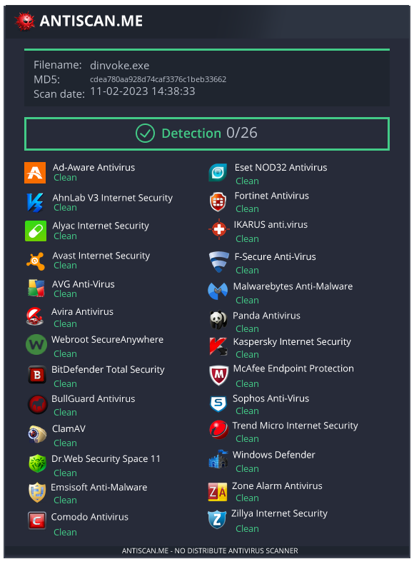

# Hollow

Trying to evade AV/EDRs using Process hollowing with standalone dynamic invocation avoiding suspicious imports and API Hooks.

## Usage
This implementation contains a xor encrypted `msfvenom` reverse_https payload, modify it with your own shellcode, compile it and profit!
To further evade detection, it is recommended to pack the executable with `PEzor` or scramble and obfuscate it with `ConfuserEx`.

# Refs
* OSEP
* [Rasta Mouse](https://web.archive.org/web/20210601171512/https://rastamouse.me/blog/process-injection-dinvoke/)
* https://bohops.com/2022/04/02/unmanaged-code-execution-with-net-dynamic-pinvoke/

## Disclaimer
This repository is for educational purposes only and should not be used for malicious purposes. The author is not responsible for any illegal use of the code.
